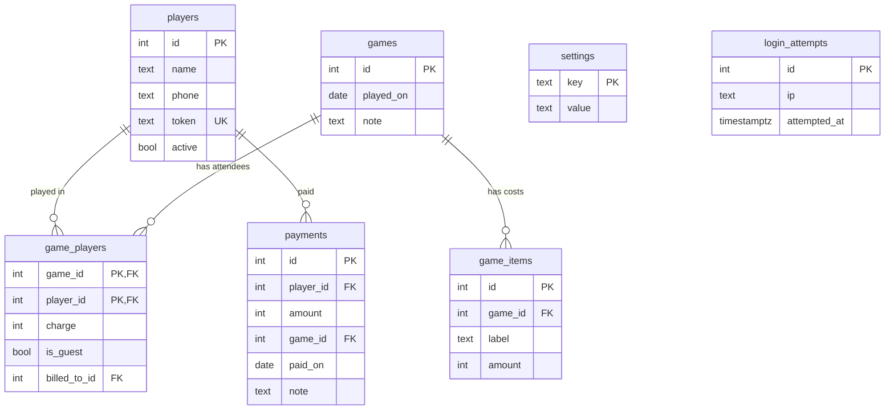

# TurfTab

A small installable web app for splitting the ground-rent of a weekly football game and tracking who has paid.

Every week a group of us rents a turf. One person pays the ground, then collects an equal share from every player who actually played — some pay straight away, some days later. There is no profit: the fee is split exactly equally, rounded up so the organiser never ends up covering a shortfall. TurfTab replaces the group-chat arithmetic and the "who still owes me?" memory test.

- **Organiser** logs in, records each game (costs + who played), and taps *Mark paid* as money arrives.
- **Players** get a private link that shows only their own balance and the games they still owe for, plus the organiser's bKash number. They never log in and never see anyone else's balance.

> Stack: Next.js 16 (App Router) · TypeScript · Tailwind CSS 4 · Neon Postgres · Drizzle ORM · Vitest · PWA
> Currency is whole taka (৳). There are no decimals anywhere in the data model.

---

## Features

| Area | What it does |
|---|---|
| **Games** | Any number of cost items per game (turf, drinks, vest washing…). Tick who played and choose how each person pays: their own share, **guest** (free), or **covered by** another player. A live preview shows `7 players → ৳429 each` and who is billed for whom. Edit or delete later. |
| **Split** | `ceil(total ÷ paying players)`. Absent players are never charged. **Guests** are excluded from the headcount, so the others split the cost; they're still listed, tagged *guest*. A **covered** share still counts in the headcount but is billed to a sponsor (who needn't be playing). The rounding surplus is shown, never hidden. |
| **Payments** | On each game's page the organiser sees who owes for that game, with a one-tap *Mark paid* (two taps, to prevent accidents) and a *Partial* amount box. The dashboard has a full-balance *Mark paid* too. Any payment can be undone. |
| **Dashboard** | Total outstanding, total collected, and who owes, biggest first, each with *Copy message* (a ready-to-paste reminder with the amount, bKash number and the player's link). |
| **Sharing** | A group link (every game with each person's share and a *guest* tag — no balances, no payment status, no transfers) and a personal link per player (that player's balance only, including anyone they cover). Both rotate on demand. |
| **Export** | Download players, games, charges, payments and balances as CSV, so the records don't depend on one database. |
| **PWA** | Installable to the home screen, opens full-screen, and shows a friendly offline page when there's no signal. |

---

## Architecture

```
Browser (PWA)
   │
   ▼
Next.js on Vercel ── proxy.ts: logged-out → 307 /login (first line of defence)
   │   ├─ (admin) pages + server actions   → requireAdmin() on every one
   │   ├─ /s/[token]  group page (public, token = credential, no balances)
   │   ├─ /p/[token]  personal page (public, token = credential, one player)
   │   └─ /export/[name]  admin-only CSV downloads
   ▼
Neon Postgres (serverless, pooled, HTTP driver)  via Drizzle ORM
```

### Data model



The key idea is that **balances are never stored**. A player's balance is always `sum(charges) − sum(payments)`, computed on read. That makes mistakes fixable (undo a payment, edit a game) with no balance field to drift out of sync.

- `game_players.charge` is each attendee's share, fixed at save time, so history doesn't shift if the formula ever changes. Editing a game regenerates its charges.
- `game_players.billed_to_id` transfers a share to another player (null = they pay it themselves), and `is_guest` marks a free player excluded from the headcount. A player's balance sums the charges **billed to** them, which is how a sponsor ends up owing for people who never owe anything themselves. CHECK constraints stop a guest being charged or billed, and a player covering themselves.
- A payment reduces the running balance, so "paid two games at once" and "paid half" need no special cases. `payments.game_id` is optional: *Mark paid* on a game's page records the payment against that game.
- Players with history can't be deleted (`ON DELETE RESTRICT`); they are archived.
- CHECK constraints keep amounts positive at the database level too.

### How a multi-game balance is displayed

Payments need a rule for *which* games they covered, so the per-game status is derived (`src/lib/ledger.ts`), in two steps:

1. A payment tied to a game (from that game's page) settles **that game first**. Anything beyond what's due there spills into a general pool.
2. Untied payments and spill-over fill the **oldest unpaid game first**.

If someone owes ৳430 for each of 3 games and the organiser taps *Mark paid* on game 3, game 3 is settled while games 1 and 2 stay unpaid. If they instead pay ৳500 with no game chosen, game 1 is paid and game 2 shows ৳360 left. Several charge lines in one game (a sponsor's own share plus the people they cover) are summed. This is only a display rule — the total owed is always the true ledger balance.

### Security model

- **One admin, no user table.** The password lives in an environment variable (`ADMIN_PASSWORD`), compared in constant time. Login sets a signed (HS256), `httpOnly`, `SameSite=Lax`, `secure`-in-production session cookie valid for a year (this is a personal tool, so long sessions are a deliberate trade-off).
- **Revocation:** change the password to block new logins; rotate `SESSION_SECRET` to invalidate every existing session at once.
- **Defence in depth.** `proxy.ts` redirects logged-out visitors before anything renders, **and** every page, server action and route handler calls `requireAdmin()` itself. Layouts are never trusted for auth (they don't re-run on client navigation).
- **Brute-force lockout:** 5 failed attempts per IP, or 50 globally, in 15 minutes, stored in Postgres (serverless has no shared memory).
- **Share links** are random 144-bit tokens. The group link's query never loads balances, payments or who a share was transferred to; the personal link's query is scoped to one player. Regenerating a token kills the old link immediately.
- **CSV export** neutralises spreadsheet formula injection (`=`, `+`, `-`, `@` prefixes in text cells).

### PWA

A hand-written ~50-line service worker (`public/sw.js`) rather than a framework plugin: it precaches the offline page and icons, caches hashed build assets, and falls back to the offline page when a navigation fails. It **never caches HTML, server actions or data** — those are logged-in money records and must always come fresh. Writes are online-only by design, so there is no sync queue or conflict handling to get wrong.

---

## Getting started

Requires Node 22+, [pnpm](https://pnpm.io) 10 and a free [Neon](https://neon.com) project.

```bash
pnpm install
cp .env.example .env.local     # then fill in the three values below
pnpm db:migrate             # creates the tables
pnpm dev                    # http://localhost:3000
```

| Variable | What |
|---|---|
| `DATABASE_URL` | Neon connection string. Use the **pooled** one (host contains `-pooler`). |
| `ADMIN_PASSWORD` | Admin login. A long passphrase, 12+ characters. |
| `SESSION_SECRET` | 32+ characters, e.g. `openssl rand -base64 48`. Rotating it logs every device out. |

Tip: create a separate Neon **branch** for local development so testing never touches your real data. Branches copy the schema instantly.

### Scripts

| Command | Does |
|---|---|
| `pnpm dev` | Dev server |
| `pnpm build` / `pnpm start` | Production build / server |
| `pnpm test` | Unit tests (Vitest) |
| `pnpm lint` | ESLint |
| `pnpm db:generate` | Generate a SQL migration from `src/db/schema.ts` |
| `pnpm db:migrate` | Apply migrations to `DATABASE_URL` |
| `pnpm db:studio` | Browse the database |

### Deploying to Vercel

1. Push to GitHub and import the repo in Vercel.
2. Add `DATABASE_URL`, `ADMIN_PASSWORD`, `SESSION_SECRET` as environment variables.
3. Set the function region close to your database (Singapore, `sin1`, for a `ap-southeast-1` Neon project) under *Settings → Functions*.
4. Run `pnpm db:migrate` once against the production database.

### Project layout

```
src/
  app/
    (admin)/        dashboard, games, players, settings, export — all admin-only
    login/          login page + server action
    s/[token]/      public group page
    p/[token]/      public personal page
    offline/        offline fallback page
    manifest.ts     PWA manifest
  components/       UI pieces (game form, confirm button, nav, …)
  db/               Drizzle schema + lazy Neon client
  lib/
    money.ts        split + rounding        ← pure, unit-tested
    ledger.ts       oldest-first allocation ← pure, unit-tested
    csv.ts          CSV encoding            ← pure, unit-tested
    session.ts      signing + constant-time compare ← pure, unit-tested
    auth.ts         cookie session + requireAdmin()
    data.ts         all reads, incl. the public share queries
    export.ts       CSV builders
  proxy.ts          logged-out redirect
public/sw.js        service worker
drizzle/            generated SQL migrations
```

---

# Case study

## The problem

I play football weekly with a group of friends. I pay the turf, then collect an equal share from everyone who played. People pay on different days, some skip a week, and guests turn up. I was keeping it in my head and in a chat thread, and I never wanted to profit from it — the point is that nobody overpays and I'm never out of pocket.

So the requirements were small but specific:

1. Split a bill made of several costs (turf, drinks, vest washing) equally among **only those who played**.
2. **Never lose money to rounding.**
3. Track late payers, including people who owe for several games.
4. Let each player check their own balance without logging in — and without seeing anyone else's.
5. Cost nothing to run, and work well on a phone at the pitch.

It's a personal tool, so I treated "market value" as irrelevant and optimised for being correct, private and pleasant to use.

## Key decisions

**Ledger, not a balance field.** The first design question was where "who owes what" lives. Storing a balance per player is the obvious move, and it's the one that goes wrong: every edit or undo has to patch it. Instead the database stores *charges* (one per player per game) and *payments*, and the balance is derived. Editing a game, undoing a mis-tap, or paying two games at once all just work, because there's no second source of truth to keep in sync.

**Round up, and show the leftover.** `ceil(total ÷ players)` guarantees collections ≥ cost. The surplus (at most under ৳1 per head) is surfaced on each game instead of silently absorbed, so the books always reconcile. A property test asserts the invariant (never undercharged, surplus under ৳1 per head) across about 1,500 total/headcount combinations.

**Payments float, but can target a game.** People usually pay "whatever I owe", not "game 3", so a payment defaults to reducing the running balance, with an oldest-first display rule. Later the organiser wanted a one-tap *Mark paid* on each game; pure floating payments would then have shown the wrong game as settled. So a payment can optionally carry a `game_id`, which settles that game first, and the rest still floats. The change was additive and the balance maths didn't move.

**Guests and transfers are billing, not special cases.** Some weeks a guest plays free and the others split the cost; other weeks the boss, or a player bringing a friend, covers someone. Instead of adjustments or negative payments, each attendee row says whether it is a guest (excluded from the headcount) and who it is billed to. The split stays one pure function (`computeCharges`), and a player's balance is simply what is billed to them. Public pages show each person's share and a *guest* tag but never who covered whom.

**Env-var password instead of an auth provider.** There is exactly one admin. A user table, OAuth and password reset would be more surface area than the whole rest of the app. A password in an environment variable, a signed cookie, and a lockout table cover the threat model (someone guessing a URL), and revocation is two env vars. I evaluated Neon Auth with Google sign-in for players and deliberately deferred it: it only pays off if players can *do* something after logging in (for example an "I've paid" button), and it adds a Google Cloud setup and iOS-PWA redirect quirks.

**Two kinds of link instead of player accounts.** Players are friends, not users. A random token in a URL gives each of them a private, zero-friction view, and the group page gives everyone the shared transparency ("here's what the turf cost and who played") without exposing balances. Both can be rotated if a link leaks.

**Neon Postgres over MongoDB.** The data is relational and it's money, so constraints and transactions matter. Neon's free tier (scale-to-zero, generous storage for a few thousand rows) fits, and its Singapore region is close to the group.

**A tiny hand-written service worker.** The usual PWA plugins assume webpack; Next 16 builds with Turbopack. More importantly, what the worker *shouldn't* do matters more than what it does: caching authenticated pages would be a privacy bug. Fifty lines I can read end to end beat a plugin I'd have to audit.

## Problems I hit

- **Redirects and 404s arrived as HTTP 200.** With a `loading.tsx` boundary, Next streams the response, so by the time a page calls `redirect()` or `notFound()` the status line is already sent. Probing the built app showed logged-out requests returned 200 with the redirect embedded in the stream. No data leaked (I checked the bodies), but it's untidy and I didn't want the guard to depend on streaming behaviour. I added `proxy.ts` so logged-out visitors get a real 307 before anything renders, and kept the per-page `requireAdmin()` as the actual gate.
- **No interactive transactions on the HTTP driver.** Saving a game must write the game, its cost items and its attendees atomically, but Neon's HTTP driver only supports batched statements, and a batch can't use an id returned by an earlier statement. I reserve the id first (`nextval`) and then write everything in one atomic batch.
- **A test that was wrong, not the code.** An end-to-end probe flagged export failures that turned out to be `fetch().text()` silently stripping the UTF-8 byte-order mark I was asserting on. Re-checking at the byte level confirmed the files were right. Worth remembering: a failing check can be the check.
- **Dependency conflict at install.** Vitest wanted newer Node typings than the scaffold pinned; matching `@types/node` to the Node version in use resolved it without forcing the install.

## How I tested it

- **Unit tests (37)** on the pure logic where mistakes cost money or trust: the split and rounding (including the no-undercharge property, also with guests), guest and transfer billing (the worked example, invalid combinations), payment allocation (partial, over-payment, game-tied payments, several charge lines per game), session signing (tampered, wrong-secret and expired tokens), and CSV encoding (quoting, formula injection, non-Latin names).
- **Live checks against a real Neon database during development**, covering the full flow: multi-item games, absent players, bad input, one-tap and partial payments, undo, game edits regenerating charges, and both share pages including token rotation. The group-page payload was asserted not to contain balance or payment data.
- **Black-box probes of the production build** for auth boundaries (logged-out, forged and wrong-secret cookies all get a 307), the PWA files and headers, and the CSV downloads.

I didn't run a browser-automation suite; UI behaviour was checked by hand in the browser.

## What I'd do differently / next

- **Player accounts with "I've paid".** The strongest reason to add sign-in (Google via Neon Auth) is letting players flag a payment for the organiser to confirm. I deferred it until the core had survived real use.
- **Offline writes.** Possible with a queue, but conflict handling for money records is a real cost for a feature that a weak signal at the pitch rarely needs.
- **Automated reminders.** Currently a *Copy message* button; SMS/WhatsApp delivery would add cost and a provider to manage.
- **Integration tests in CI.** The live-database checks were run during development but aren't in the repo; a throwaway Neon branch per CI run would make them repeatable.

## Takeaways

Most of the quality here comes from small structural choices made early — derive balances instead of storing them, round in the direction that protects the organiser, keep the privacy boundary in the queries rather than the UI — and from checking behaviour on the real build, not just in the editor. A small app still taught me where framework defaults (streaming, caching, auth in layouts) can quietly work against you.
